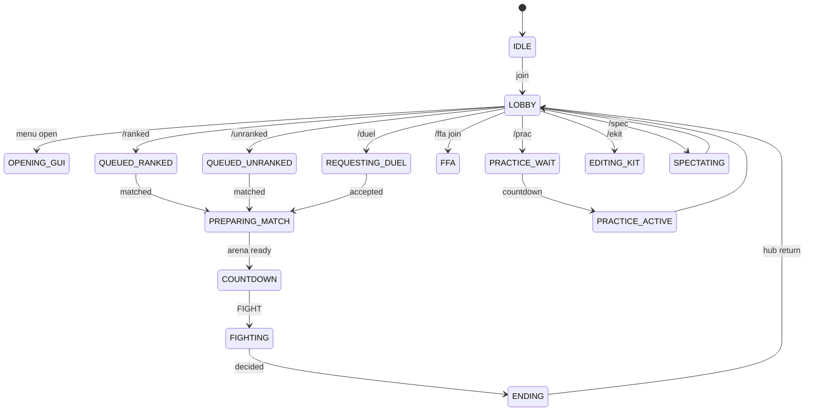
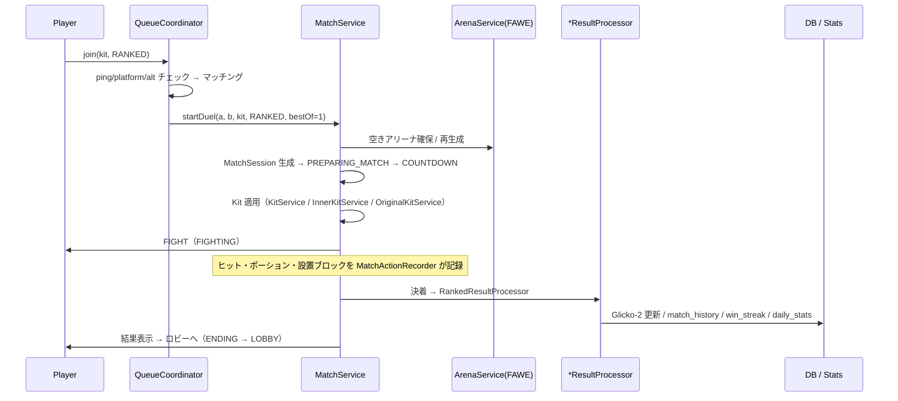

# N Arena (RumilancePractice) — プロジェクト全貌 & WorkFlow ガイド

> 対象: `ifuto/RumilancePractice` / ブランチ `arena/01a106b3-rumilancepractice`
> 作成: 2026-10-04 / ベースコミット `271a59a` (v1.92.35)
>
> このドキュメントは「リポジトリを開いた瞬間に全体像と開発手順が分かる」ことを目的とした
> オンボーディング / アーキテクチャ / 運用の単一窓口です。詳細は各専門ドキュメントへ
> （末尾「関連ドキュメント」参照）。

---

## 0. 30 秒サマリ

**Paper 1.21.11 向けの Minecraft Practice PvP サーバープラグイン「N Arena」**を、
**1 つの巨大 Java プロジェクト + 周辺ツール群（Python / Fabric Mod / Discord Bot / CI 配送パイプライン）**
で自前実装しているリポジトリ。

- プラグイン名は `NARENA`、データフォルダは `plugins/n-arena`（旧名 `RumilancePractice` から移行済み）
- ランク戦 / アンランク戦 / チーム戦 / FFA / プラクティス（BOT 練習）/ AFK クリスタル練習 をすべて内蔵
- 最大の特徴は **「参照実装（Fabric MOD + Quantum データパック）の挙動を Paper 上で 1 関数ずつ再現する」
  というパリティ検証ループ** が CI・計測ツール・ドキュメント一式として同居していること
- 開発は **GitHub Actions が唯一のビルド環境**（サンドボックスから Maven / Modrinth / Azure は遮断）

---

## 1. 数字で見る規模

| 指標 | 数値 |
|---|---|
| 追跡ファイル総数 | 1,997（`.git` 除く / 約 34 MB） |
| Java ソース（本番） | **552 ファイル / 121,597 行** |
| Java ソース（テスト） | **103 クラス / 8,893 行** |
| Java パッケージ | 78（`com.rumilance.practice.*`） |
| リスナー実装クラス | 87（`implements Listener` 該当ファイル数。`FeatureBootstrap` 内の匿名リスナーは別途） |
| GUI 画面 | **77 メニュー** + GUI 基盤 24 クラス |
| コマンド定義（`plugin.yml`） | **104** |
| 同梱リソース | 1,065 ファイル（うち **mcfunction 816** / JSON 213） |
| DB マイグレーション | **36 世代**（`schema_version` 管理） |
| Repository クラス | 18 |
| 運用設定 YAML | 16 種（`plugins/n-arena/` に自動生成） |
| 対応言語 | 7（`en_us` `en_gb` `ja_jp` `ko_kr` `zh_cn` `es_es` `fr_fr`） |
| 現在バージョン | **1.92.35**（`gradle.properties` が正） |

### 巨大ファイル Top 10（触るとき要注意）

| 行 | ファイル | 役割 |
|---|---|---|
| 5,668 | `practice/PracticeService.java` | 練習 BOT（Mannequin AI）の心臓部。全モードの tick 処理 |
| 3,411 | `match/MatchService.java` | 試合の開始〜終了・結果処理の統括 |
| 2,592 | `bootstrap/FeatureBootstrap.java` | 全サービス / GUI / リスナー / コマンドの配線（**全機能の目次**） |
| 2,361 | `practice/afk/AfkCrystalManager.java` | AFK クリスタル練習部屋 |
| 2,220 | `ffa/FfaService.java` | FFA 全体 |
| 1,448 | `gui/menus/EditKitGui.java` | キット編集 GUI |
| 1,419 | `team/TeamService.java` | パーティ |
| 1,166 | `command/PracticeAdminCommand.java` | 管理者コマンド |
| 1,161 | `turbo/WindowsOptimizationService.java` | JVM / GC 最適化 |
| 1,082 | `quantum/QuantumRuntime.java` | 同梱データパック実行エンジン |

---

## 2. 何をするプロジェクトか

```
[Minecraft Java Edition クライアント] ──(1.21.11)──> [Paper サーバー + 本プラグイン]
                                                          │
                       ┌──────────────────────────────────┼──────────────────────────┐
                       │                                  │                          │
                ロビー / マッチメイク              練習・BOT 戦              運営・配信まわり
                (ranked / unranked / team / FFA)   (prac / afkc / bot)     (Discord Bot / Shield Web / RP)
```

提供する遊び方:

1. **ランク戦 (RANKED)** — Glicko-2 で PT（レート）が変動。キルデス・勝率・連勝も記録
2. **アンランク戦 (UNRANKED)** — **いかなる統計も変更しない**（`UnrankedResultProcessor`）。この不変条件はテストで保証
3. **チーム戦 (TEAM)** — 最大 20 人 vs 20 人。PT 変動なし
4. **FFA** — 常設アリーナ。`/bot` でマネキン練習台（Quantum BOT とは別物）
5. **プラクティス (`/prac`)** — 5 モード（CRYSTAL / NETHERITE_POT / MACE / CART / SWORD）の BOT 戦
6. **AFK クリスタル (`/afkc`)** — フル装備 BOT + 100×100 ネザライト床の個人練習部屋（パケット遮断で他者からは不可視）

---

## 3. 技術スタック

| レイヤ | 内容 |
|---|---|
| 言語 / JDK | Java 21（toolchain 明示、`options.release=21`） |
| サーバー | Paper `1.21.11-R0.1-SNAPSHOT`（Mojang マッピング = NMS 直接利用可） |
| ビルド | Gradle 9.6.1 + **Shadow 9.6.0** + **paperweight userdev 2.0.0-beta.23** |
| 依存（shade） | HikariCP 7.1.0 / sqlite-jdbc 3.53 / mariadb-java-client 3.5（ relocate 済み） |
| 依存（compileOnly） | Paper API / WorldEdit 7.3 / ProtocolLib 5.4 / LuckPerms API 5.4 |
| テスト | JUnit 6.1.2（Jupiter）+ 独自 `reportTestFailures` タスク |
| 永続化 | SQLite（既定）/ MariaDB 切り替え可、`SchemaMigrator` による世代管理 |
| クライアント Mod | `kb-probe/` — Fabric + fabric-loom 1.14.7（**専用 Gradle 8.13 wrapper**） |
| 周辺 | リソースパック（フォント/badge）、Discord Bot（Node.js）、Python 解析ツール |

### ビルド成果物

```
./gradlew build   ( = test + shadowJar + resourcePackZip )
  ├─ build/libs/RumilancePractice-<version>.jar   ← これが配布物（fat JAR）
  ├─ build/libs/RumilanceResourcePack.zip / .sha1
  └─ server-icon.png（branding からコピー）
```

---

## 4. ディレクトリ全マップ

```
RumilancePractice/
├── src/
│   ├── main/java/com/rumilance/practice/   ← 本番コード 552 ファイル
│   ├── main/resources/
│   │   ├── plugin.yml                      ← コマンド 104 / 権限 / soft-depend
│   │   ├── lang/*.yml                      ← 7 言語
│   │   ├── kb/*.json                       ← ノックバック実測プロファイル（Club/Lunar/Stray/Vanilla/Velt）
│   │   ├── quantum-pack/Practicebot/       ← 同梱データパック（mcfunction 816 本）
│   │   ├── tab-layout.csv / scoreboard.yml
│   │   ├── shield-web/                     ← Shield Web の HTML アセット
│   │   └── branding/server-icon.png
│   └── test/java/...                       ← 103 テストクラス
│
├── docs/                                   ← ドキュメント群（★情報密度が高い）
│   ├── FEATURES.md                         ← 全機能インベントリ（44 KB）
│   ├── プラグイン完全解説.md                ← 100 KB の仕様書（v1.2.0 基準・やや古い）
│   ├── bot-combat-parity.md                ← BOT 戦闘関数の対応表（参照実装 ↔ 本プラグイン）
│   ├── gui-rebuild-inventory.md / gui-design-reference.md / design/gui.json
│   ├── system-level-optimization-design.md / lightweight-optimization-research.md
│   ├── kb-probe-verification.md / shield-web.md / START-BAT-GC-GUIDE.md / RESOURCE_PACK.md
│   ├── tab/README.md                       ← 内蔵 TAB 実装の説明
│   └── parity/                             ← ★ Fabric 実測フィクスチャ（.log.gz / タイムライン SVG）
│
├── ci/
│   └── java-env.sh                         ← 545 行。実行環境構築 + 起動検証 + git 配送の正本
├── tools/
│   ├── localtest/                          ← Bukkit 無しで回すテストループ（ecj + JUnit スタブ）
│   ├── parity-runner/                      ← パリティ計測用データパック + ビルド/比較スクリプト
│   ├── qlog-datapack/                      ← 参照側ラウンド維持（keepalive / start_round）
│   ├── release/                            ← build-pack.sh / attach-pack.sh / publish.sh
│   ├── parity_*.py, fight_*.py             ← ログ解析・可視化
│   ├── add_custom_shield.py
│   └── mc-skin-poser/ (Cloudflare Worker), paper-bridge-spike/
│
├── kb-probe/                               ← 別 Gradle プロジェクト：KB 実測 Fabric クライアント Mod
├── discord-bot/                            ← Node.js（チャンネル自動構築 + キルログ Webhook）
├── resourcepack/                           ← 配布 RP のソース（フォント / アイコン / pack.mcmeta）
├── dist/                                   ← リリース済み RP（zip + sha1）
├── bot/                                    ← 参照実装の原本（Quantum ワールド zip / Herobot MOD jar）
├── server-mappings/narena/                 ← Lunar Client 申請用（metadata.json + logo.png）
├── images/                                 ← rank アイコン等
├── .recovery/                              ← 過去の事故復旧作業跡（CFR 逆コンパイル結果・コンパイルログ）
├── gui.json / docs/design/gui.json         ← GUI モックアップのセーブデータ（内容は別物・注意）
└── .cursor/rules/always-build.mdc          ← ★「毎回ビルド・バージョン bump」のエージェント規約
```

---

## 5. アーキテクチャ

### 5.1 レイヤ構造

```
┌─────────────────────────────────────────────────────────────────┐
│ Entry: RumilancePractice (JavaPlugin)                           │
│   onEnable → ConfigService.loadAll() → DB migrate → Bootstrap    │
└───────────────────────────┬─────────────────────────────────────┘
                            │
┌───────────────────────────▼─────────────────────────────────────┐
│ DI: bootstrap/ServiceRegistry  （型安全なサービスロケータ）       │
│   Config / PluginSettings / AsyncExecutor / SessionManager /     │
│   PlayerStateManager / LocaleService / MessageService /          │
│   GlickoCalculator / FaweBridge / DatabaseService / Repository×18│
└───────────────────────────┬─────────────────────────────────────┘
                            │
┌───────────────────────────▼─────────────────────────────────────┐
│ Wiring: bootstrap/FeatureBootstrap.enable()  （2,592 行）         │
│   ① サービス生成 → ② GUI 生成 → ③ コマンド登録 → ④ リスナー登録   │
│   → ⑤ 定期タスク開始。★全機能の「目次」はこの 1 ファイル            │
└───────┬───────────────┬───────────────┬───────────────┬─────────┘
        │               │               │               │
┌───────▼─────┐ ┌───────▼─────┐ ┌───────▼─────┐ ┌───────▼─────────┐
│ Domain      │ │ GUI         │ │ Command     │ │ Listener (87)   │
│ Services    │ │ (77 menus)  │ │ (104)       │ │ combat/guard/…  │
│ match,queue │ │ + GuiSession│ │ + tab完成   │ │ Bukkit イベント │
│ ffa,practice│ │   Registry  │ │             │ │                 │
│ team,duel…  │ │             │ │             │ │                 │
└───────┬─────┘ └─────────────┘ └─────────────┘ └─────────────────┘
        │
┌───────▼─────────────────────────────────────────────────────────┐
│ Infra: database/(Hikari + 36 migrations + 18 repositories)        │
│        util/ config/ locale/ sound/ platform/ turbo/              │
└──────────────────────────────────────────────────────────────────┘
```

### 5.2 起動シーケンス（`RumilancePractice.onEnable`）

1. `ServiceRegistry` 生成 / `ItemKeys.init`
2. **旧データフォルダ `plugins/RumilancePractice` → `plugins/n-arena` への一度きり移行**（`PluginIdentity`）
3. `ConfigService.loadAll()` — 16 種の YAML を読み込み・不足分を資源からコピー
4. `PluginSettings` 生成、`AsyncExecutor` 生成（1〜4 スレッド・既定 2）
5. `SessionManager` / `PlayerStateManager` / `LocaleService` / `MessageService` 登録
6. **DB 初期化 + `SchemaMigrator.migrate()`** → 18 リポジトリ登録（失敗時はプラグイン無効化）
7. `GlickoCalculator`（tau 設定付き）
8. **FAWE 存在判定** → `FaweBridgeImpl` or `NoOpFaweBridge`（無くても起動する）
9. `FeatureBootstrap.enable()` — ここで全機能が生える
10. `plugins/NARENA/USE_n-arena_FOLDER.txt` を書いて運営を正しいフォルダへ誘導

停止時（`onDisable`）: `featureBootstrap.disable()` → **遅延保存中の設定を flush** → DB close → Executor shutdown → Registry clear。

### 5.3 状態機械（`state/PlayerState`）



全遷移は `PlayerStateManager`（UUID キー）が一元管理。`MatchMode` は
`RANKED / UNRANKED / FFA / TEAM` の 4 値で、統計への影響を決める。

### 5.4 試合フロー（最重要パス）



### 5.5 ドメイン別モジュール一覧（78 パッケージ）

| ドメイン | パッケージ | 規模(行) | 役割 |
|---|---|---:|---|
| **配線** | `bootstrap` | 2,633 | `ServiceRegistry` + `FeatureBootstrap`（全機能の目次） |
| **試合** | `match` (+`history`/`inventory`/`result`) | 7,021 | MatchService / Registry / 結果処理 3 種 / リプレイ連携 |
| **BOT練習** | `practice` (+`afk`) | 12,127 | **最大ドメイン**。Mannequin AI、5 モード、AFK クリスタル部屋 |
| **GUI** | `gui` (+`menus`) | 24,742 | **行数最大**。77 メニュー + 基盤（`GuiLayout`/`MenuScaffold`/`UiTheme`） |
| **コマンド** | `command` | 8,378 | 43 クラス |
| **FFA** | `ffa` | 5,384 | FFA 本体 / マネキン / TPA / RTP / スポーン計算 |
| **戦闘** | `combat` | 4,823 | KB 調整、ダメージ帰属、クリスタル/ベッド/アンカー、KillFeed |
| **キット** | `kit` `originalkit` `ekit` | 5,423 | 公式キット / オリジナルキット / プリセット / CrystalFFA |
| **DB** | `database` (+`repository`) | 3,085 | Hikari、36 マイグレーション、18 リポジトリ |
| **チーム** | `team` | 3,175 | パーティ、招待、自動解散、トーナメント連携 |
| **Quantum** | `quantum` | 2,480 | 同梱データパック実行エンジン（関数レジストリ / インスタンス） |
| **HeroBot** | `herobot` | 3,117 | フェイクプレイヤー（carpet 式）+ HeroBot 動詞の解釈 |
| **ShieldWeb** | `shieldweb` | 2,354 | 内蔵 HTTP でカスタム盾をブラウザ管理（パック再構築込み） |
| **最適化** | `turbo` | 2,138 | GC / アイドル管理 / Windows 最適化 / tick 計測 |
| **スコアボード** | `scoreboard` | 2,989 | スコアボード・TAB 一体実装（外部 TAB プラグイン非依存） |
| **アリーナ** | `arena` (+`fawe`) | 1,956 | テンプレート / 使い捨て / FAWE 再生成（ソフト依存） |
| **リプレイ** | `replay` | 1,166 | 通報の証跡再生 |
| **ロビー** | `lobby` | 1,549 | ロビー範囲・アイテム・浮遊文字 |
| **パケットBOT** | `packetbot` | 965 | NMS 直叩きのフェイクプレイヤー |
| **運営** | `admin` `ban` `punishment` `report` | 1,765 | BAN / ChatBan / 通報 / 管理 GUI |
| **セキュリティ** | `security/sign` `guard` `alt` | 2,539 | 看板 Mod 検査、キック抑止、アイテム流出防止、Alt 検知 |
| **その他** | `util`(3,219) `model`(1,735) `cosmetic` `locale` `settings` `stats` `rank` `tier` `skill` `glicko` `sound` `spectator` `countdown` `tnt` `tournament` `testarena` `world` … | — | ユーティリティ・データモデル・見た目・多言語 etc. |

---

## 6. データ層

- **バックエンド**: SQLite（既定）/ MariaDB。`database.yml` で切替、HikariCP で接続プール
- **マイグレーション**: `SchemaMigrator` が `schema_version` テーブルを見て未適用分のみ逐次実行
  - v1〜36。代表的: v24 `player_ranks`、v28 `player_name_colors`、**v34 ranked_stats を Elo→Glicko-2 へ移行＆レート初期化**、v35 Alt 検知テーブル群
- **リポジトリ 18 クラス**: Player / Settings / RankedStats / MatchHistory / Punishment / AuditLog /
  KitLayout / OriginalKit / DailyRankedStats / FfaStats / Objection / AnnualStreak /
  PracticeLayout / WinStreak / PlayerReport / SpamDetection / KitPreset / Alt
- **設定 YAML 16 種**（`plugins/n-arena/` に自動生成、遅延保存＋シャットダウン時 flush）:
  `config` `database` `gui` `sounds` `profile` `kits` `arenas` `practices` `lobby` `ffa`
  `plans` `arrow-effects` `kill-effects` `ekit-items` `preset-items` `scoreboard`

---

## 7. GUI 体系とデザイン規約

- **識別はタイトル文字列ではなく `PracticeGuiHolder` + セッション UUID**（`GuiSessionRegistry`）
- **レイアウト語彙は `GuiLayout` に集約**: `pair(3,5)` / `hero(col4)` / `widePair` / `centredRow` / `band(cols1-7)`。
  画面側に生スロット番号を書かない → 規約変更は 1 ファイルで完結
- **デザイン規範（v1.88.0 全面刷新）**: 装飾ガラス枠の全廃 / 左右対称 / 主役ボタンは中央 /
  7 列グリッド / ページナビは「前[2] — 戻る[4] — 次[6]」固定
- **木時差式ボタン `DelayedButton`**: 押して 4 tick 後に開く（確実動作のための意図的遅延）
- モックアップは `docs/design/gui.json`（KIT EDIT GUI ほか）と `docs/design/gui-mockups.md`

---

## 8. 開発 WorkFlow（★最重要セクション）

### 8.1 基本サイクル（`.cursor/rules/always-build.mdc` に明文化）

```
  編集 (Java / Gradle / YAML / resources)
        │
        ├─ 1) gradle.properties の version を +1  ── ★必須。上げ忘れたら CI を通さない
        │
        ├─ 2) ./gradlew test shadowJar   （ローカルに JDK/Gradle があれば）
        │      └─ 無い/通らない場合は (3) の CI が代替
        │
        ├─ 3) git commit → push（セッションブランチ = arena/01a106b3-...）
        │
        ├─ 4) gh run watch         … build ワークフローの完了を待つ
        ├─ 5) 失敗 → gh run view --log-failed → 修正 → 再 push（緑になるまで）
        └─ 6) 成功 → gh run download -n jars で JAR を確認
```

> **なぜローカルビルドではなく CI なのか**
> このサンドボックスは **github.com / api.github.com / codeload / pypi / npm のみ通信可**で、
> **Maven（PaperMC / Fabric / Mojang）、Modrinth、Azure Blob（Actions の artifact / release）は遮断**
> されています（実測: `repo.papermc.io` は接続不能）。したがって
> **Actions の ubuntu ランナーが唯一のビルド手段**です。

### 8.2 CI ワークフロー 4 本

| ファイル | 発火 | 中身 |
|---|---|---|
| `.github/workflows/build.yml` | push 全て / 手動 | **`./gradlew build`**（test + shadowJar + RP zip）。<br>失敗時に `error:` `Caused by:` `expected:` `.java:NNN:` 等を grep して `::error::` アノテーション化。<br>`build-log` と `jars` を常に artifact 化 |
| `.github/workflows/java-env.yml` | `java-trigger.md` への push / 手動 | **薄いディスパッチャ**。実処理はすべて `ci/java-env.sh`（545 行） |
| `.github/workflows/build-mod.yml` | `kb-probe/**` / 手動 | Fabric Mod の Loom ビルド（**Gradle 8.13 専用 wrapper**） |
| `.github/workflows/customize.yml` | `Trigger.md` / 手動 | Trigger.md のコードフェンスを bash 実行。**現在は不使用**（下記「罠」参照） |

**`ci/java-env.sh` がやること（これがプロジェクトの生命線）**

1. **リソースパックの Release 公開**（`tools/release/publish.sh`。失敗しても止めない = fail-soft）
2. Temurin JDK 21 取得 → `jdk21.tar.gz`
3. Paper 1.21.11 取得
4. **Fabric 実測サーバー一式を組み立てて起動検証**（Fabric + fabric-api + HeroBot MOD + Quantum マップ + qlog データパック）
5. 当プラグインを `./gradlew test shadowJar`
6. kb-probe Mod をビルド
7. **git ブランチへ配送**（90 MB 分割 + sha256）:
   - `java-env-delivery` … JDK + Paper jar
   - `paper-server-delivery` … `paper-run/` 一式（RCON 25576 / pass `rumilance`）
   - `mc-server-delivery` … Fabric 実測サーバー
   - `plugin-delivery` … `RumilancePractice-<version>.jar`
8. 進捗・失敗は `::notice::` / `::error::` アノテーションに畳む（**ログ本体はサンドボックスから読めない**）

### 8.3 3 層のテスト戦略

| 層 | 手段 | 何时 |
|---|---|---|
| **権威** | `./gradlew test` + `reportTestFailures` タスク（CI） | 全変更。JUnit XML を解析し「クラス > メソッド → メッセージ @ 行」を 1 行でビルド失敗に載せる |
| **ローカル代替** | `tools/localtest/localtest.sh`（ECJ + 自作 JUnit スタブ + jdk4py） | Maven/Gradle が使えない環境。`org.bukkit` 等を import するクラスを除外し、純ロジックだけ回す |
| **実機** | Paper ヘッドレス（`-Drumilance.harness=true`）+ `/narena-harness` | BOT 戦の数値検証 |

> `configurations { testImplementation.extendsFrom(compileOnly) }` により、
> テストは Paper API / WorldEdit の **コンパイル時 API だけ**を見られます。
> サーバーを起動せずに `YamlConfiguration` 等へ依存するクラスをテストできる仕掛けです。

### 8.4 パリティ検証ループ（このプロジェクトの独自工程）

```
  参照側 (Fabric 実サーバー)                     当側 (Paper + 本プラグイン)
  ┌────────────────────────────┐                ┌────────────────────────────┐
  │ Herobot MOD (BOT AI)       │                │ Mannequin AI (practice/)   │
  │ Quantum データパック 856関数 │   ← 数値一致 →  │ QuantumRuntime + HeroBot   │
  │ qlog データパック (維持)     │                │ /narena-harness            │
  └────────────┬───────────────┘                └────────────┬───────────────┘
               │  .log.gz 実測フィクスチャ                     │ ヘッドレス実行ログ
               │  docs/parity/*.log.gz (250s / 310s / 400s)   │
               └───────────────┬─────────────────────────────┘
                               ▼
              tools/parity_*.py, fight_timeline.py, compare_fights.py
                               ▼
              docs/bot-combat-parity.md の対応表を埋める（✅ が揃うまで往復）
```

- 参照側の「会場の作り方」は **非自明**（石で深さ 100 ブロック充填 /
  `herobot explosionNoBlockDamage true perm world` 必須）。`docs/parity/README.md` に手順が固定されている
- 実測で確定している硬い数値例: アンカー **設置→チャージ 4t**、**設置サイクル最小 12t**（= 4+4+4）
- `kb-probe/`（Fabric クライアント Mod）は **他サーバーの実効ノックバック係数を実測**する別軸の計測器。
  保護领域・無敵時間・移動中などをガードして「正しくない KB は計らない」

### 8.5 リリース / リソースパック

```
resourcepack/ ──tools/release/build-pack.sh──> dist/RumilanceResourcePack.zip (+ .sha1)
                                                   │
                    tools/release/attach-pack.sh <tag> ──> GitHub Release に添付
                    tools/release/publish.sh（java-env.sh から自動実行・冪等）
```

- `build-pack.sh` は **フォント provider が指すテクスチャ欠落 / 未配線テクスチャを検出して失敗**する
  （過去に PRO バッジ `U+E004` が消えた事故の再発防止）
- `dist/` は `sha1sum -c` で検証できる形式（`<hash>  <file>`）
- 配布 SHA1 は **`build-pack.sh` 側のものが正**。`resourcePackZip` タスクはローカル簡易ビルド扱い

### 8.6 ブランチ運用

| ブランチ | 意味 |
|---|---|
| `main` | **ほぼ空**（画像 4 枚のみ）。実コードは入っていないので注意 |
| `arena/<session-id>-rumilancepractice` | **実際の作業単位**。セッションごとに 1 本 |
| `java-env-delivery` / `paper-server-delivery` / `mc-server-delivery` / `plugin-delivery` | CI が自動生成する成果物配送ブランチ |
| `feature/practice-bulk-fix-1.9.2` | 過去の機能ブランチ |

現在の親ブランチ `arena/01a100fe-...` は `build` が green（v1.92.36 まで到達）。

---

## 9. 暗黙ルール・罠（先に知っておくべきこと）

| # | 罠 | 対処 |
|---|---|---|
| 1 | **エージェントは `.github/workflows/**` を push できない**（GitHub App に `workflows` 権限が無い） | ロジックは `ci/` と `tools/` に置き、workflow は人間が貼る。`ci/build-mod.yml` が正本 |
| 2 | `customize.yml` は**失敗しても success になる**欠陥あり（v3/v4/v5 で実証） | **現在使用停止**（`Trigger.md` に理由が書いてある）。代わりに `java-env.yml` を使う |
| 3 | サンドボックスから Maven / Modrinth / Azure Blob が遮断 | 成果物は **git 配送ブランチ経由**で受け取る（`gh api repos/.../contents/...?ref=<delivery>`） |
| 4 | CI のログ本文は読めない | 成否は `::error::` / `::notice::` アノテーションに畳む設計。`gh run view --log-failed` |
| 5 | `gradle.properties` のバージョンを上げ忘れる | ルール化済み。CI の `jars` artifact のファイル名で二重チェック |
| 6 | Fabric Mod は **Gradle 8.13 専用 wrapper** が必要（fabric-loom 1.7-SNAPSHOT は Gradle 9 と不整合） | ルート wrapper（9.6.1）と混ぜない |
| 7 | `org.slf4j` を relocate / 同梱すると Paper 側の SLF4J が死ぬ | `shadowJar` で明示的に除外済み |
| 8 | `org.sqlite` を relocate すると JNI が壊れる | relocate 対象外（コメントで明記） |
| 9 | プラグイン名 `NARENA` とデータフォルダ `n-arena` が違う | `PluginIdentity` が一元管理。Paper が作る `plugins/NARENA` には案内ファイルを置く |
| 10 | アンランク戦で統計が動くと仕様違反 | `UnrankedResultProcessor` + `UnrankedStatsImmutabilityTest` で保証 |
| 11 | GUI をタイトル文字列で判定すると壊れる | `PracticeGuiHolder` + セッション UUID で識別 |
| 12 | 機能アイテムを表示名で判定すると壊れる | PDC `function_type` で識別（`rumilancepractice` 名前空間） |
| 13 | ルート `gui.json` と `docs/design/gui.json` は**別物**（同名で混乱しやすい） | モックアップのセーブデータ。参照時はパスに注意 |
| 14 | `version.yml`（1.76.57）は**どこからも参照されていない**放置物 | `gradle.properties`（1.92.35）が正 |
| 15 | `.recovery/` は過去の事故復旧の残骸（CFR 逆コンパイル結果・コンパイルログ一式） | 通常の開発では参照不要 |
| 16 | サーバー停止時の切断 ChatBan は**発行しない**仕様/`TIMEOUT` `IDLING` `FLYING_*` のキックは `KickGuardListener` が握りつぶす | バグではなく意図。触る前に README の「重要仕様」を読む |

---

## 10. 主要コマンド（抜粋）

| 系統 | コマンド |
|---|---|
| 対戦 | `/duel` `/d` `/ranked` `/rd` `/unranked` `/accept` `/deny` `/cancel` `/queue leave` |
| 移動 | `/lobby` `/spawn` `/spec` `/specgui` |
| 情報 | `/stats` `/kdr` `/profile` `/ranking` `/tier` `/players` |
| キット | `/ekit` `/ekitadmin` `/setting` |
| FFA | `/ffa` `/bot` `/regear` `/k` `/repair` `/heal` `/tpa` `/rtp` `/rtpqueue` |
| 練習 | `/prac` `/practice`（管理）`/afkcrystal` `/afkc` `/afk` |
| 運営 | `/practiceadmin` `/arena` `/ban` `/chatban` `/reportlist` `/replay` `/signcheck` `/setrank` `/setfunc` |
| 開発 | `/quantum …`（データパック実行）`/botadmin` `/testarena` `/narena-harness` `/turbo` |

権限は `rumilance.user`（既定 true）/ `rumilance.admin`（op）/ `rumilance.owner`（**予約のみ。OWNER ランクは付与しない**）/
`rumilance.user.def|mem|vip|vip_plus`（プラン）/ `*.bypass` 各種。

---

## 11. 関連ドキュメント（読む順のおすすめ）

| 順 | ドキュメント | 内容 |
|---|---|---|
| 1 | `README.md` | 導入・セットアップ・重要仕様・トラブルシュート |
| 2 | **`bootstrap/FeatureBootstrap.java`** | 全機能の配線。コードで読む最新の全貌 |
| 3 | `docs/FEATURES.md` | 全機能インベントリ（44 KB） |
| 4 | 本ドキュメント | 全体像と WorkFlow |
| 5 | `docs/bot-combat-parity.md` + `docs/parity/README.md` | BOT 挙動のパリティと実測手順 |
| 6 | `docs/プラグイン完全解説.md` | 詳細仕様（100 KB。**v1.2.0 時点なので古い箇所あり**） |
| 7 | `docs/gui-rebuild-inventory.md` / `gui-design-reference.md` | GUI 規約 |
| 8 | `tools/plugin_runtime.md` | 実機検証環境の 0 からの作り方 |
| 9 | `system-level-optimization-design.md` / `lightweight-optimization-research.md` | 最適化の設計と調査 |
| 10 | `docs/shield-web.md` / `docs/kb-probe-verification.md` / `docs/tab/README.md` | 各サブシステム |

---

## 12. 現状の所見（改善提案）

1. **`main` ブランチが空** — 作業は全て `arena/*`。初見者が `main` を見ると空リポジトリに見える。
   せめて `main` に最新コードをマージするか、README で明示したい（現在は README も `main` に無い）
2. **`version.yml`（1.76.57）が放置** — 参照ゼロ。削除か `gradle.properties` からの自動生成を推奨
3. **放置物の整理候補** — `javac.20260926_*.args`（3 本の同一ファイル）、`log/`、
   `.recovery/`（CFR jar 2 MB）、ルート `gui.json`
4. **`docs/プラグイン完全解説.md` は v1.2.0 基準** — 現在 v1.92.35。乖離が大きい。
   FEATURES.md との役割分担（「仕様の正本はどちらか」）を決めると迷いが減る
5. **`bootstrap/FeatureBootstrap.java` が 2,592 行** — ドメイン別（match / ffa / practice / gui / admin…）に
   `XxxBootstrap` へ分割すると、コンフリクトと可読性が大きく改善する
6. **`practice/PracticeService.java` が 5,668 行** — モード別（Sword / Mace / Crystal / Pot / Cart）に
   ストラテジ分離の余地あり（対応表が `bot-combat-parity.md` にあるので境界は明確）
